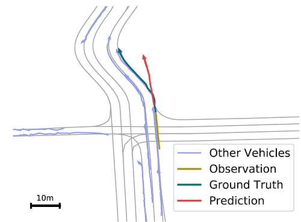

# Natural Scene Attack : Vehicle trajectory prediction works, but not everywhere


In this project, you can find the official codes of the paper and instructions on how to run them. The codes are in python.

Table of Contents
=================
  * [Install Dependancy](#install-dependency)
  * [Changing Config File](#changing-config-file)
  * [Making Synthesized Scenarios](#making-synthesized-scenarios)
  * [Transferring Scenarios](#transferring-scenarios)
  * [Finetuning Model](#finetuning-model)
  * [Real-World Searching](#real-world-searching)
 
## Install Dependency
You need to install packages listed in requirements.txt. You can do so by running the code bellow:
```shell script
pip install -r requirements.txt
```

## Changing Config File
You should have [argoverse](https://www.argoverse.org/)'s Motion Forecasting data available on the machine you plan to run this project on. 
In addition, you need to download LaneGCN's trained model [here](http://yun.sfo2.digitaloceanspaces.com/public/lanegcn/36.000.ckpt) and have the weights of trained model for DATF and WIMP model.
You should also download argoverse's preprocessed validation data from [here](https://yun.sfo2.cdn.digitaloceanspaces.com/public/lanegcn/val_crs_dist6_angle90.p).
After downloading everything, you should edit the first five lines of the `config.py` file.
You should fill the first one with the path to argoverse's validation data folder. 
Fill the second, third and forth with path to the LaneGCN, DATF, and WIMP model's weights respectively and last one with the path of the preprocessed data you have downloaded.
You can see an example of how to fill them correctly in the code bellow:
```python
argo_dataset_path = "/.../argoverse-api/val/data"
lanegcn_model_weights_path = "./36.000.ckpt"
datf_model_weights_path = "/.../experiment/attgscam.argo"
wimp_model_weights_path = "/.../experiments/example2/checkpoints/"
argo_preprocessed_data_path = "./val_crs_dist6_angle90.p"
``` 


## Making Synthesized Scenarios
To make the synthesized scenarios and test the baseline models on these scenarios, you should run `main.py` with the following arguments: 
* Using `--model_name` argument you can specify the baseline (the options: LaneGCN, MPC, DATF, WIMP)
* using `--n_scenarios` you can specify the number of scenarios (default 20)

The output of running this code is SOR and HOR percentages in table 1 of the paper.

If you insert `--optimization_type` (options: baysian, evolution, parzen) the code will reproduce the results in table 2 of supplementary materials.

Also, if you want to save the scenario images, you can determine the saving directory using `--save_addr`.

For example, if you want to reproduce the results of the table 1 for DATF model in 70 scenarios and save all the scenario images in the folder `scenario-images/datf-images` you should run the following script:
```shell script
python main.py --model_name "DATF" --n_scenarios 70 --save_addr "datf-images"
```
And here is a sample image of a synthesized scenario:


## Transferring Scenarios

If you want to reproduce results of the table 4, first you should run the `main.py` with the argument `--transfer` to save the attack parameters obtains for this model in the `transfer-attack-files` folder then you should run again and specify the model you want to transfer the attack parameters from using the argument `--transfer_from` and it will use to attack the model that is specified by `--model_name` (in this case you should specify the number of scenarios used in first run). 

For example, if you want to transfer attack parameters from LaneGCN model to WIMP model for 50 scenarios, the following two lines would do it:
```shell script
python main.py --model_name "LaneGCN" --n_scenarios 50 --transfer
python main.py --model_name "WIMP" --n_scenarios 50 --transfer_from "LaneGCN"
```

## Finetuning model
In order to finetune the original LaneGCN model using our synthesized scenarios, you should firstly download the train an validation synthesized data from [here](https://drive.google.com/file/d/1X97vxcC5vEhLXtb0HBvSkRlAHntDc_nj/view?usp=sharing). You should extract this zip file and then update `syn_data_train_path` and `syn_data_val_path` in config file. Finally, run `finetune.py` to train the original LaneGCN model using the synthesized data. 

## Real-World Searching
Fortunately, the data needed for this part is small and is uploaded to git, so by cloning the repository you should have no problem retrieving real-world scenarios.
All you need to do is to run `real_world_scenario_finder.py` and after the program finishes, you may see the results of retrieving in the last folder of `retrieved_scenario_images`. 

Here is a sample retrieval result:


### Adding another city to searching area 

Additionally, if you want to add more cities to the search space, you should do the following:
1. Go to [this site](https://extract.bbbike.org/) and select the area in which you want to add. Then download OSM data from this site in PBF format and save it. Also remember to save the lat-lon of the bounding box of the selected area.
2. Add the saved lat-lon in the previous step in `real_world_scenario_finder.py` file in the following format, near the similar lines of code for other available cities:
    ```python
    min_xs["$CityName$"], min_ys["$CityName$"], _, _ = utm.from_latlon(min_lat, min_lon)
    max_xs["$CityName$"], max_ys["$CityName$"], _, _ = utm.from_latlon(max_lat, max_lon)
    ```
3. Save the downloaded OSM data somewhere and then using the `extract_road` function in `real_world_scenario_finder.py`, preprocess and save needed data using the following code:
   ```python
   way_node_locations, way_types = extract_roads("path_to_saved_OSM_file")
       with open(os.path.join("find_scenario_images", city_name + "_way_node_locations.pkl"), "wb") as f:
            pickle.dump(way_node_locations, f)
       with open(os.path.join("find_scenario_images", city_name + "_way_types.pkl"), "wb") as f:
            pickle.dump(way_types, f)
   ```
4. Finally, load the saved way_node_locations pickle file and add the city's name and the loaded file to way_node_locations dictionary in `real_worl_scenario_finder.py`.

### Searching for other queries
In order to search for other queries in the cities, you should add the query to the `query_ways` list.
Each query is a list of roads, with each road being a list of points with coordinates in the [0, 200] range.
